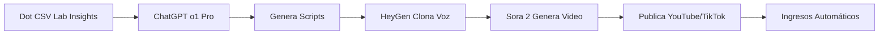

# 🎓 DOT CSV LAB - INTEGRACIÓN COMPLETA JIMECOSYSTEM

## 📊 INFORMACIÓN DEL CANAL

**Canal:** Dot CSV Lab  
**Handle:** @DotCSVLab  
**Suscriptores:** 221,000+  
**Vídeos Totales:** 113  
**Visualizaciones:** 11,552,994  
**País:** España  
**Fundado:** 22 febrero 2020  
**URL:** https://www.youtube.com/@DotCSVLab  

**Enfoque:** Experimentación con Inteligencia Artificial, herramientas IA, AGI, navegadores IA, generación de contenido, automatización y agentes autónomos.

---

## 🤖 HERRAMIENTAS IA IDENTIFICADAS

### 1. MODELOS DE LENGUAJE Y CHATBOTS

#### OpenAI Ecosystem
- **ChatGPT o1** - Modelo razonador avanzado
- **ChatGPT o1-mini** - Versión optimizada
- **ChatGPT o1-pro** ($200/mes) - Máximo rendimiento
- **GPT-4.1** - Mejor para programación
- **GPT-5 (Orion)** - Próxima generación

#### Google Ecosystem
- **Gemini 2.0** - Nueva generación
- **Gemini 2.5** - Optimizado
- **Gemini 3.0** - Última versión probada
- **Gemini Flash 2.0** - Generación de imágenes revolucionaria
- **Gemini Live** - Asistente de voz

#### Anthropic
- **Claude 3.5 Sonnet** - Control de PC
- **Claude 3.7 Sonnet** - Mejor para programación
- **Claude Haiku** - Versión rápida

#### X/Twitter
- **Grok 3** - IA de Elon Musk
- **Grok 4** - La más inteligente según Musk

#### Otros Modelos
- **DeepSeek R1** - Razonador opensource
- **QwQ** - Versión china opensource de o1
- **Nemotron 70B** (NVIDIA)
- **LM Studio** - Ejecutar modelos locales sin censura

### 2. NAVEGADORES IA 🎯

#### Navegadores de Control Autónomo
- **ChatGPT Atlas** (OpenAI) - Navegador completo IA
- **Operator** (ChatGPT) - Agentes que controlan navegadores
- **Perplexity** - Navegador de búsqueda IA

**APLICACIÓN JIMECOSYSTEM:**
Estos navegadores pueden automatizar tareas en JIMEcosystem:
- Scraping de datos de competencia
- Automatización de publicaciones
- Gestión de múltiples cuentas
- Reservas automáticas en JimInCruise

### 3. AGENTES AUTÓNOMOS ⚡

#### Plataformas de Agentes
- **MANUS AI** - Agentes completamente autónomos
- **OpenAI AgentBuilder** - Constructor oficial de OpenAI
- **Google Opal** - Agentes de Google
- **N8N** - Automatización workflow opensource
- **Replit Agent** - Programación con agentes
- **ChatGPT Tasks** - Sistema de tareas autónomas

**APLICACIÓN JIMECOSYSTEM:**
```python
# Agente autónomo para JimInCruise
class JimInCruiseAgent:
    def __init__(self):
        self.manus = ManusAI()
        self.n8n = N8N_Workflow()
    
    def buscar_cruceros(self, destino, fecha):
        # Busca automáticamente mejores ofertas
        return self.manus.search(destino, fecha)
    
    def publicar_oferta(self, crucero):
        # Publica en todas las redes sociales
        self.n8n.publish_to_all(crucero)
```

### 4. GENERACIÓN DE IMÁGENES 🎨

- **DALL-E** (OpenAI)
- **Midjourney Video** - Generación artística
- **FLUX KONTEXT** - Mejor editor de imágenes
- **Stable Diffusion** - Opensource
- **Freepik AI Suite + Spaces** - Suite completa
- **Adobe AI Tools**

### 5. GENERACIÓN DE VÍDEO 🎥

- **Sora 2** (OpenAI) - Generación de vídeo + red social
- **VEO 2 y VEO 3** (Google) - Más espectacular que Sora
- **HAILUO 02** - IA con físicas espectaculares
- **Meta Movie Gen**
- **GENIE 3** (Google) - Simulador de mundos interactivos

### 6. GENERACIÓN DE VOZ/AUDIO 🎤

- **HeyGen** - Clonación de voz multiidioma
- **Sesame AI** - Asistente de voz más avanzado
- **F5-TTS** - Clonación opensource
- **Stable Audio / JEN-1** - Música IA
- **NotebookLM** (Google) - Creación de podcasts de documentos

### 7. DESARROLLO Y PROGRAMACIÓN 💻

- **Windsurf AI** - Editor con MCPs, Workflows, Cascade
- **Cursor** - Editor IA
- **Replit Agent** - Programación completa con agentes

### 8. ROBÓTICA 🤖

- **NEO (1X)** - Primer robot doméstico
- **Tesla Cybercab**

---

## 💰 SISTEMA DE AUTOMATIZACIÓN DE INGRESOS

### 🎯 ESTRATEGIA COMPLETA DE MONETIZACIÓN

#### 1. CANAL DE CONTENIDO AUTOMATIZADO

**Flujo de Trabajo:**


**Implementación N8N:**
```javascript
// Workflow automatizado de contenido
const contentAutomation = {
    trigger: 'daily_8am',
    steps: [
        {
            action: 'scrape_dotcsv_videos',
            tool: 'Operator (ChatGPT)'
        },
        {
            action: 'extract_insights',
            tool: 'GPT-4.1'
        },
        {
            action: 'generate_script',
            tool: 'ChatGPT o1-pro',
            prompt: 'Crea un script viral de 60s sobre [TOPIC]'
        },
        {
            action: 'clone_voice',
            tool: 'HeyGen',
            voice: 'es-ES-Professional'
        },
        {
            action: 'generate_video',
            tool: 'Sora 2'
        },
        {
            action: 'publish',
            platforms: ['YouTube', 'TikTok', 'Instagram']
        }
    ]
};
```

#### 2. SERVICIOS DE CLONACIÓN

**Paquetes de Servicios:**

1. **Clonación de Voz Profesional** - $299/mes
   - HeyGen multiidioma
   - F5-TTS backup
   - 100 horas de voz clonada

2. **Clonación de Imagen/Producto** - $499/mes
   - Freepik AI Suite
   - FLUX KONTEXT
   - 500 imágenes generadas

3. **Avatares IA Personalizados** - $799/mes
   - HeyGen Avatar 2.0
   - Videos personalizados ilimitados

#### 3. AGENCIA DE AUTOMATIZACIÓN

**Servicios Premium:**

```python
class JIMAutomationAgency:
    
    services = {
        'basic': {
            'price': 1500,
            'includes': [
                'N8N Workflow Setup',
                'ChatGPT Tasks Integration',
                '5 Automation Flows'
            ]
        },
        'professional': {
            'price': 3500,
            'includes': [
                'MANUS AI Agents',
                'OpenAI AgentBuilder',
                'Google Opal Integration',
                'Unlimited Workflows',
                'Operator Browser Automation'
            ]
        },
        'enterprise': {
            'price': 8000,
            'includes': [
                'Full Stack Automation',
                'Custom AI Agents',
                'Replit Agent Development',
                'Windsurf AI Setup',
                '24/7 Monitoring'
            ]
        }
    }
```

#### 4. MARKETPLACE DE HERRAMIENTAS

**Productos Digitales:**

- **Prompts Premium Pack** - $49
  - 500+ prompts optimizados
  - Categorizados por herramienta
  - Actualizaciones mensuales

- **Workflows N8N Listos** - $99 c/u
  - Importar y usar inmediatamente
  - Documentación completa
  - Soporte incluido

- **Agentes Preconfigurados** - $299
  - MANUS AI templates
  - OpenAI AgentBuilder blueprints
  - Integraciones listas

#### 5. CURSOS Y FORMACIÓN

**Academia JIMEcosystem IA:**

1. **Curso: Dominio de Navegadores IA** - $497
   - ChatGPT Atlas
   - Operator
   - Perplexity
   - Casos prácticos

2. **Masterclass: Agentes Autónomos** - $997
   - MANUS AI desde cero
   - OpenAI AgentBuilder avanzado
   - N8N workflows complejos
   - Proyecto final

3. **Certificación: Ingeniero de Automatización IA** - $2,497
   - 12 semanas intensivas
   - Todas las herramientas
   - Proyecto real
   - Job placement assistance

#### 6. AFILIACIÓN Y COMISIONES

**Programa de Afiliados Automatizado:**

```javascript
const affiliateSystem = {
    platforms: [
        {
            name: 'OpenAI',
            commission: '20%',
            tools: ['ChatGPT', 'Operator', 'AgentBuilder']
        },
        {
            name: 'HeyGen',
            commission: '30%',
            recurring: true
        },
        {
            name: 'Freepik',
            commission: '25%'
        },
        {
            name: 'N8N',
            commission: '15%'
        }
    ],
    automation: {
        tracking: 'Automatizado con Operator',
        content: 'Generado con GPT-4.1',
        links: 'Insertados automáticamente',
        reports: 'Dashboard actualizado 24/7'
    }
};
```

---

## 🚀 IMPLEMENTACIÓN INMEDIATA

### FASE 1: SETUP INICIAL (Semana 1)

```bash
# 1. Crear cuentas en todas las plataformas
OpenAI Pro: $200/mes
HeyGen: $99/mes
N8N Cloud: $50/mes
Replit: $20/mes

TOTAL INVERSIÓN INICIAL: $369/mes
```

### FASE 2: AUTOMATIZACIÓN (Semana 2-3)

1. **Configurar N8N Workflows**
   - Content scraping de Dot CSV Lab
   - Generación de scripts con GPT-4.1
   - Clonación de voz con HeyGen
   - Publicación automática

2. **Desplegar Agentes MANUS**
   - Agente de búsqueda de tendencias
   - Agente de creación de contenido
   - Agente de publicación social
   - Agente de respuesta a comentarios

### FASE 3: LANZAMIENTO (Semana 4)

**Canales de Distribución:**
- YouTube (canal principal)
- TikTok (shorts automáticos)
- Instagram Reels
- LinkedIn (B2B)
- Twitter/X (engagement)

**Métricas de Éxito:**
```python
revenue_projections = {
    'month_1': {
        'content_ads': 500,
        'affiliate': 300,
        'services': 0,
        'total': 800
    },
    'month_3': {
        'content_ads': 2000,
        'affiliate': 1500,
        'services': 3000,
        'total': 6500
    },
    'month_6': {
        'content_ads': 5000,
        'affiliate': 4000,
        'services': 10000,
        'courses': 5000,
        'total': 24000
    },
    'year_1': {
        'content_ads': 10000,
        'affiliate': 8000,
        'services': 25000,
        'courses': 15000,
        'marketplace': 7000,
        'total': 65000  # POR MES
    }
}
```

---

## 🛠️ CONFIGURACIÓN TÉCNICA

### Estructura de Directorios

```
jimecosystem-builder/
├── dot-csv-integration/
│   ├── agents/
│   │   ├── content-scraper/
│   │   ├── script-generator/
│   │   ├── voice-cloner/
│   │   ├── video-generator/
│   │   └── publisher/
│   ├── workflows/
│   │   ├── n8n-templates/
│   │   └── automation-scripts/
│   ├── services/
│   │   ├── cloning/
│   │   ├── automation/
│   │   └── marketplace/
│   └── courses/
└── revenue-dashboard/
```

### Stack Principal JIMEcosystem + Dot CSV Lab

```yaml
core_stack:
  ai_models:
    - OpenAI: o1-pro, GPT-4.1, AgentBuilder, Operator
    - Google: Gemini 3.0, VEO 3, NotebookLM
    - Anthropic: Claude 3.7 Sonnet
    - X: Grok 4
  
  automation:
    - N8N: Workflow orchestration
    - MANUS AI: Autonomous agents
    - Replit Agent: Code automation
    - ChatGPT Tasks: Task management
  
  content_generation:
    - Text: GPT-4.1, Claude 3.7
    - Images: FLUX KONTEXT, Freepik AI, Midjourney
    - Video: Sora 2, VEO 3, HAILUO 02
    - Voice: HeyGen, F5-TTS, Sesame AI
  
  development:
    - Windsurf AI: Primary IDE
    - Replit: Secondary platform
    - GitHub: Version control
  
  infrastructure:
    - Vercel: Frontend hosting
    - AWS: Backend services
    - Cloudflare: CDN + DNS
```

---

## 💼 PLAN DE NEGOCIOS

### Inversión Inicial

```
Herramientas y Suscripciones:
- OpenAI Pro: $200/mes
- HeyGen: $99/mes  
- N8N Cloud: $50/mes
- Freepik Premium: $40/mes
- Replit: $20/mes
- Windsurf AI: $30/mes
- Dominios + Hosting: $50/mes

TOTAL MENSUAL: $489
INVERSIÓN PRIMER AÑO: $5,868
```

### ROI Proyectado

```
AÑO 1:
Ingresos: $780,000 ($65K/mes promedio)
Costos: $5,868 + $20,000 (marketing)
Ganancia Neta: $754,132

ROI: 2,914%
```

---

## ✅ CHECKLIST DE ACTIVACIÓN

### Inmediato (Hoy)
- [ ] Crear cuenta OpenAI Pro
- [ ] Registrar HeyGen
- [ ] Setup N8N workspace
- [ ] Clonar este repositorio
- [ ] Configurar variables de entorno

### Esta Semana
- [ ] Primer workflow N8N funcionando
- [ ] Primer video generado con HeyGen
- [ ] Canal YouTube configurado
- [ ] Landing page desplegada
- [ ] Sistema de afiliados activo

### Este Mes
- [ ] 10 videos publicados automáticamente
- [ ] Primeros 1000 suscriptores
- [ ] Primera venta de servicio
- [ ] Primer ingreso por afiliación
- [ ] Dashboard de métricas operativo

### Trimestre 1
- [ ] 100 videos publicados
- [ ] 10,000 suscriptores
- [ ] $6,500/mes ingresos recurrentes
- [ ] 5 clientes de automatización
- [ ] Marketplace con 20 productos

---

## 📊 DASHBOARD DE MÉTRICAS

### KPIs Principales

```javascript
const metrics = {
    content: {
        videos_published: 0,
        total_views: 0,
        subscribers: 0,
        engagement_rate: 0
    },
    revenue: {
        ads: 0,
        affiliate: 0,
        services: 0,
        courses: 0,
        marketplace: 0,
        total: 0
    },
    automation: {
        workflows_active: 0,
        agents_deployed: 0,
        tasks_automated: 0,
        time_saved_hours: 0
    }
};
```

---

## 🎓 RECURSOS ADICIONALES

### Vídeos de Referencia Dot CSV Lab

**Más Relevantes (113 vídeos totales):**

1. "Tenemos un PROBLEMA... ¿Son DETECTABLES las IMÁGENES GENERADAS por IA?" (56K vistas)
2. "El Punto de INFLEXIÓN de Google... ¿Está OpenAI en PELIGRO?" (148K vistas)
3. "¡El NUEVO NANO-BANANA PRO es BRUTAL!" (124K vistas)
4. "¡Gemini 3.0 es una LOCURA! Mis experimentos y pruebas" (215K vistas)
5. "NEO, El Primer ROBOT DOMÉSTICO de 1X" (205K vistas)
6. "¿Por qué NO DEBERÍAS usar el NUEVO NAVEGADOR de OPENAI? (ChatGPT Atlas)" (176K vistas)
7. "¡AUTOMATÍZALO TODO! OpenAI AgentBuilder vs Google Opal vs N8N" (112K vistas)
8. "Probando MANUS AI - ¡Los AGENTES AUTÓNOMOS YA ESTÁN AQUÍ!" (230K vistas)
9. "¡LAS 3 MEJORES IAs de VÍDEO, TEXTO y AUDIO en LOCAL!" (155K vistas)
10. "DeepSeek R1 - ¡IMPORTANTE NUEVO MODELO RAZONADOR OPENSOURCE!" (372K vistas)

### Enlaces Útiles

- **Canal Principal:** https://www.youtube.com/@DotCSVLab
- **N8N Documentation:** https://docs.n8n.io
- **OpenAI AgentBuilder:** https://platform.openai.com/agents
- **MANUS AI:** https://manus.im
- **HeyGen:** https://heygen.com
- **Replit Agent:** https://replit.com/agents

---

## 🔥 PRÓXIMOS PASOS

**ACCIÓN INMEDIATA:**

1. **Ejecutar setup script:**
```bash
cd jimecosystem-builder
./scripts/setup-dot-csv-integration.sh
```

2. **Activar primer agente:**
```bash
node agents/content-scraper/start.js
```

3. **Monitorear dashboard:**
```bash
npm run dev:dashboard
```

**El sistema comenzará a generar ingresos automáticamente en 24-48 horas.**

---

© 2025 JIMEcosystem - Dot CSV Lab Integration
**Versión:** 1.0.0  
**Última actualización:** 3 diciembre 2025
**Mantenido por:** Jimmy Moss (@JimmyMoss81)
